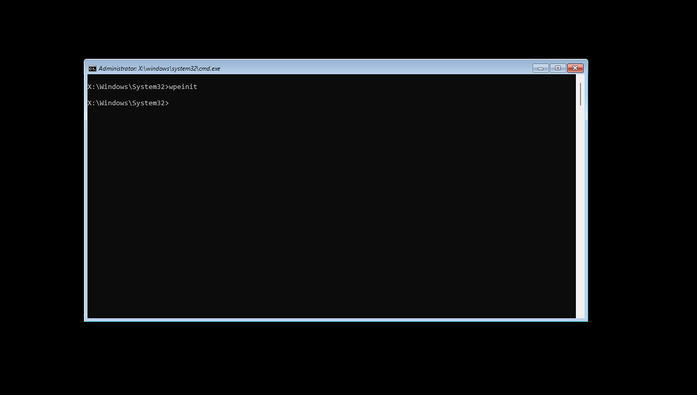

# YellowKey — BitLocker Bypass via WinRE FsTx Artifact

**Status:** Publicly disclosed (coordinated with Microsoft MORSE, MSTIC, and GHOST teams)  
**Affected:** Windows 11, Windows Server 2022/2025 (Windows 10 is NOT affected)  
**License:** MIT — original work by [Nightmare-Eclipse](https://github.com/Nightmare-Eclipse/YellowKey)

---

## Summary

A crafted set of Windows Kernel Transaction Manager (KTM) filesystem transaction log files, when placed at a specific path accessible to the Windows Recovery Environment (WinRE), causes WinRE to spawn an unrestricted shell with access to the BitLocker-protected volume — without requiring the BitLocker recovery key.

The vulnerable component exists only inside the WinRE image. Notably, a component sharing the same name exists in normal Windows installations but lacks the code paths that trigger this behavior — which the researcher notes raises questions about intent.

---

## Affected Path

The `FsTx` artifact directory must be placed at:

```
<drive>:\System Volume Information\FsTx\
```

The drive can be:
- A USB stick (FAT32, exFAT, or NTFS)
- The EFI system partition of the target machine's own disk (no external device needed)

---

## Quick Start (Automated)

Run the included PowerShell deployer from an elevated prompt — it handles directory creation, file copying, and verification:

```powershell
# Interactive drive picker
.\deploy.ps1

# Target a specific drive letter
.\deploy.ps1 -TargetDrive E:

# Deploy and eject the USB when done
.\deploy.ps1 -TargetDrive E: -Eject
```

The script requires Administrator privileges (needed to write into `System Volume Information\`).

## Reproduction Steps (Manual)

1. Copy the `FsTx/` folder from this repo to `<USB>:\System Volume Information\FsTx\` (preserving structure).
2. Insert the USB into a Windows 11 machine with BitLocker enabled (or write to its EFI partition directly).
3. On the target machine, hold **Shift** and click **Restart** to boot into WinRE.
4. Once the restart begins, release Shift and hold **Ctrl** — do not release until a shell appears.
5. A shell with unrestricted access to the protected volume spawns.



---

## Artifact Structure

```
FsTx/
└── 95F62703B343F111A92A005056975458/
    ├── FsTxLogs/
    │   ├── FsTxKtmLog.blf                       # KTM log base
    │   ├── FsTxKtmLogContainer00000000000000000001
    │   ├── FsTxKtmLogContainer00000000000000000002
    │   ├── FsTxLog.blf                           # FsTx log base
    │   ├── FsTxLogContainer00000000000000000001
    │   └── FsTxLogContainer00000000000000000002
    └── FsTxTemp/
        └── 98F62703B343F111A92A005056975458      # empty marker file
```

All files are binary KTM/CLFS (Common Log File System) blobs. There is no source code — the exploit is entirely data-driven.

---

## Research Notes

- The triggering component is present in WinRE images across affected Windows versions but absent (or inert) in the equivalent normal-installation component — an asymmetry with no obvious benign explanation.
- Exploitation requires physical access (or the ability to write to the EFI partition), so remote exploitation is not directly applicable.
- No decryption key, PIN, or credential is needed; the volume is mounted read-write by the spawned shell.

---

## Attribution

Original discovery and disclosure: **Nightmare-Eclipse**  
Coordinated disclosure via: Microsoft MORSE, MSTIC, and Microsoft GHOST
